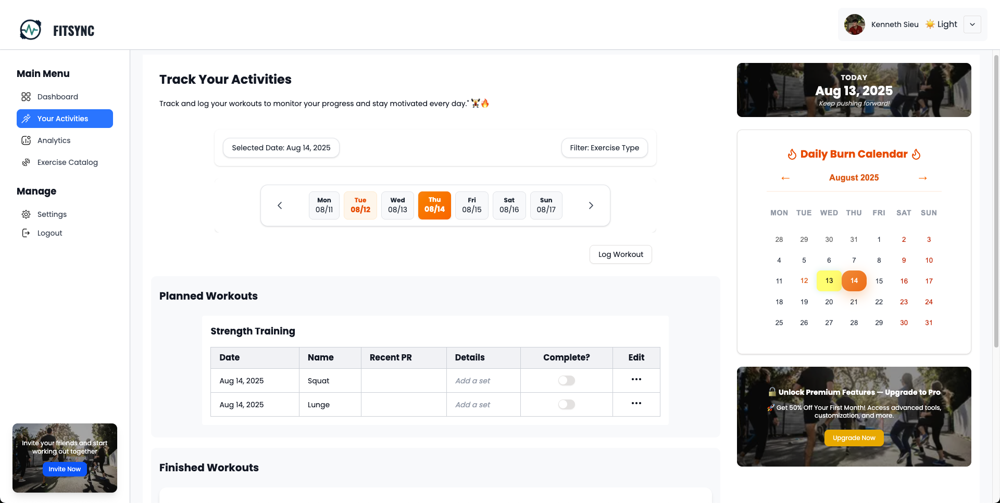

# FITSYNC

FITSYNC is a modern fitness tracking web application that helps users monitor workouts, personal records, and exercise analytics. Built with Next.js (App Router) and Tailwind CSS, FITSYNC offers a smooth user experience with dark mode support, mobile responsiveness, and seamless navigation.

---

## Screenshots





## Features

- User Authentication with Supabase
- Workout tracking and analytics dashboards
- Personal records tracking with categorized stats
- Exercise catalog and trends
- Responsive design with Tailwind CSS
- Dark mode toggle
- Loading progress bar similar to YouTube's style
- Settings sidebar and profile dropdown with hover interactions
- Full SSR and App Router support

---

## Technologies Used

- Next.js 13 (App Router)
- React
- Tailwind CSS
- Supabase (Auth and Database)
- Radix UI components
- React Query
- Recharts (for charts)
- NextNProgress (customized progress bar)
- Google Fonts (Oswald)
- MUI/Luicde Icons
- Next/Image for optimized image handling

---

## Installation

1. Clone the repository:

```bash
git clone https://github.com/yourusername/fitsync.git
cd fitsync
```

2. Install dependencies:

```bash
npm install
# or
yarn install
```

3. Create a `.env.local` file and add your environment variables:

```
NEXT_PUBLIC_SUPABASE_URL=your_supabase_url
NEXT_PUBLIC_SUPABASE_ANON_KEY=your_anon_key
NEXT_PUBLIC_SUPABASE_IMG_URL=your_image_base_url
```

4. Run the development server:

```bash
npm run dev
# or
yarn dev
```

---

## Usage

- Navigate the sidebar or profile dropdown to explore the dashboard, analytics, activities, and settings.
- Track your workouts and see visual summaries in charts and cards.
- Adjust theme preferences in settings for light or dark mode.
- Enjoy mobile-friendly layouts with optimized UX.

---

## Customization

- Modify Tailwind config for colors and themes.
- Update components in `/app` directory.
- Add new analytics or workout tracking features as needed.

---

## Contributing

Contributions are welcome! Please open issues or submit pull requests.

---

## License

MIT License © 2025 Kenneth Sieu

---

## Contact

For questions or support, reach out at kkennethsieu@gmail.com
